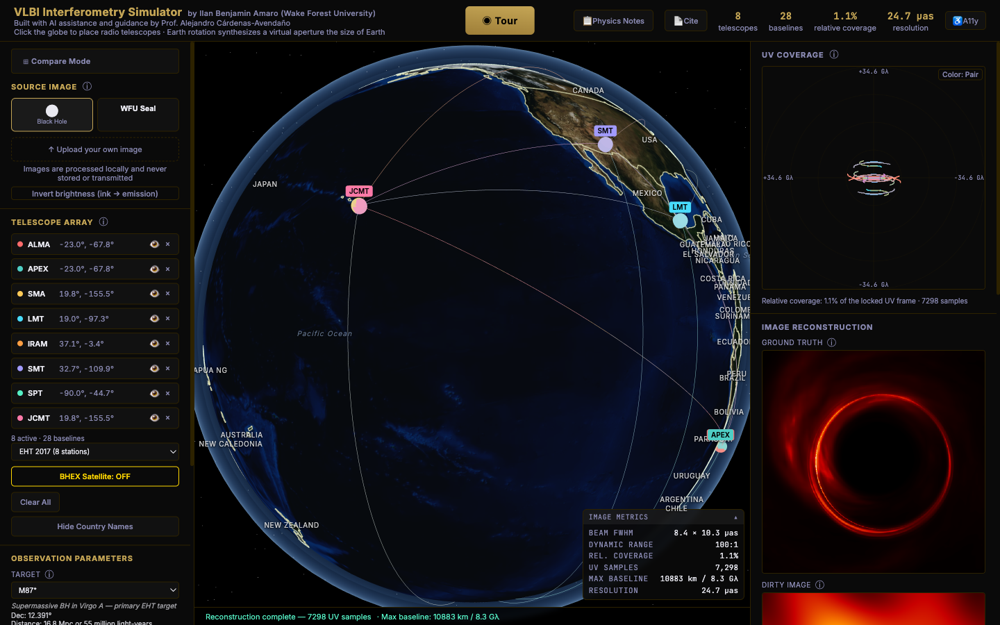
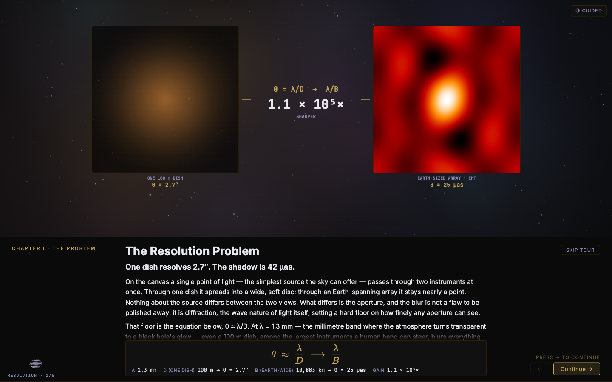

# VLBI Interferometry Simulator

A research-grade, browser-based simulator of **Very Long Baseline Interferometry (VLBI)**
image reconstruction — the technique the Event Horizon Telescope used to photograph a black
hole. Place radio telescopes on a 3-D Earth, watch the planet's rotation synthesize a virtual
aperture the size of the globe, and reconstruct astronomical images from the sparse Fourier
samples that a real array actually measures.

The reconstruction is not a mock-up. It runs genuine aperture-synthesis math — real *u,v*
sampling from telescope geometry and Earth rotation, then **CLEAN (Högbom)** and
**Maximum-Entropy** deconvolution in a Web Worker — the same pipeline, in miniature, that
produces real EHT images.

**▶ Live app: https://ilanbenamaro-cyber.github.io/astrophysics-applet/vlbi-react/**

Built by **Ilan Benjamin Amaro** (Wake Forest University), with physics guidance from
**Prof. Alejandro Cárdenas-Avendaño** and EHT array-coordinate validation from
**Dan Marrone**.

---

## What it does

Two connected experiences:

**A guided, engine-real tour** — a five-act walkthrough (*Resolution → The Synthesized
Aperture → From Data to Image → First Light → Beyond Earth*) that builds the physics from
the diffraction limit up to the M87\* image. Every act is driven by the *actual* simulation
engine — the numbers and images on screen are computed, not illustrated.

**An interactive tool** — place telescopes by clicking the globe or load real array presets,
then explore how coverage, resolution, and image fidelity respond:

- **Real arrays:** EHT 2017 (8 stations), EHT 2022 (11), and ngEHT Phase 1 (17), each with
  published site coordinates, dish diameters, and SEFD sensitivities.
- **Sky targets:** M87\*, Sgr A\*, 3C 279, Cen A — each sets its true declination and, for the
  black holes, its physical shadow size.
- **BHEX** — a proposed space element in a ~26,562 km orbit that extends *u,v* coverage to
  ~35 Gλ, far beyond what any Earth-bound baseline can reach.
- **Custom images** — upload your own picture and image it at *its own* angular scale, which
  reveals the core teaching point: fine detail lives at high spatial frequencies that only
  long baselines measure, and enlarging a source trades resolution against coverage
  (occupancy ∝ 1/FOV²), so each array has a sweet spot.
- Live diagnostics: dirty image, CLEAN reconstruction, contour map, beam FWHM, dynamic range,
  UV coverage, and a resolution budget.

## The science, briefly

VLBI turns a handful of radio dishes scattered across the planet into one telescope as wide as
the Earth. Each pair of telescopes (a *baseline*) measures a single Fourier component of the
sky; as the Earth rotates, each baseline sweeps an arc through the *u,v* (spatial-frequency)
plane. The array never fills that plane — coverage is sparse — so the raw inverse transform (the
"dirty image") is riddled with sidelobes. **Deconvolution** (CLEAN, Maximum Entropy) recovers a
plausible sky from that sparse sampling.

Resolution is set by the longest baseline, θ ≈ λ/B. Observing at **230 GHz** (λ = 1.3 mm), the
longest Earth baseline that can see M87\* is **IRAM ↔ JCMT ≈ 10,883 km**, giving
θ ≈ **24.7 μas** — just fine enough to resolve M87\*'s **42 μas** shadow (Sgr A\*'s is 50 μas).
That is why the EHT works at all, and why a single 100 m dish (θ ≈ 2.7″, ~10⁵× coarser) never
could. The simulator computes all of these numbers live from the geometry you set up; nothing
is hard-coded scenery.

## Tech

- **React 18 + [htm](https://github.com/developit/htm) + Three.js**, loaded via native ES-module
  import maps — **no bundler, no build step**. Open the HTML and it runs.
- The FFT, *u,v* gridding, CLEAN, and Maximum-Entropy solvers run in a **Web Worker**, keeping
  the UI responsive while the reconstruction computes.
- Pure client-side: uploaded images are processed locally and never transmitted.

To run locally, serve the folder over HTTP (ES modules require it) and open
`vlbi-react/index.html` — e.g. `python3 -m http.server` then browse to the `vlbi-react/`
path. No dependencies to install.

## How it was built

This project was built iteratively with AI assistance under expert physics review. The
development notes, session prompts, physics decision records, and design language that shaped
it are kept in [`.workflows/`](.workflows/) — a deliberately public record of *how* it was
made and *why* each physics choice was made. If you are curious about the process as much as
the product, start with `.workflows/_knowledge/` (codebase, decisions, gotchas) and
`.workflows/_system/` (session continuity, physics audits).

> **Note on the two apps:** the polished, actively-developed app is under
> [`vlbi-react/`](vlbi-react/) (the live link above). An earlier standalone Leaflet-based
> version lives at the repository root and is retained for history; it is not the current app.

## Credits & license

- **Physics guidance & scientific review:** Prof. Alejandro Cárdenas-Avendaño (Wake Forest
  University).
- **EHT array-coordinate validation:** Dan Marrone (EHT).
- **The M87\* image** (`assets/eht-m87-2019.jpg`) is © EHT Collaboration, CC BY 4.0.

Licensed under the [MIT License](LICENSE). Bundled third-party data assets retain their own
original licenses (see `LICENSE`).
